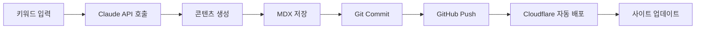

# AdPress.kr 프로젝트 Requirements

> 광고 수익 최적화 전문 정보 사이트
> 도메인: adpress.kr
> 목표: AI 기반 콘텐츠 자동 발행 시스템 구축

---

## 📋 프로젝트 개요

### 사이트 정보
- **도메인**: adpress.kr
- **사이트명**: 애드프레스 (AdPress)
- **태그라인**: "광고 수익을 프레스하다"
- **주제**: 애드센스, 애드포스트 등 광고 수익 최적화 전략
- **타겟 사용자**: 블로거, 유튜버, 온라인 부업 희망자

### 핵심 목표
1. ✅ Next.js 기반 정적 사이트 생성 (SSG)
2. ✅ AI 기반 콘텐츠 자동 생성 및 발행 파이프라인
3. ✅ SEO 최적화 (Google 검색 1페이지 목표)
4. ✅ 애드센스/제휴마케팅 수익화 구조 내장
5. ✅ 이메일 수집 및 뉴스레터 자동화
6. ✅ 완전 자동화된 월간 수익 리포트 발행

---

## 🛠 기술 스택

### Frontend
- **Framework**: Next.js 14+ (App Router)
- **Language**: TypeScript
- **Styling**: Tailwind CSS
- **Content**: MDX (Markdown + React Components)
- **Icons**: Lucide React
- **Charts**: Recharts

### Backend / Automation
- **AI**: Claude API (Anthropic)
  - Model: `claude-sonnet-4-20250514`
  - 용도: 콘텐츠 생성, 리라이팅, SEO 최적화
- **Language**: Python 3.11+
- **Scheduler**: APScheduler 또는 GitHub Actions
- **환경 변수**: `.env.local`

### Deployment & Hosting
- **Platform**: Cloudflare Pages (무료)
- **CDN**: Cloudflare (자동)
- **DNS**: Cloudflare DNS
- **Analytics**: Google Analytics 4
- **Search**: Google Search Console, Naver Search Advisor

### External Services
- **Email**: Mailchimp API (뉴스레터)
- **Ads**: Google AdSense
- **Affiliate**: Coupang Partners API

---

## 📁 프로젝트 구조

```
adpress/
├── public/
│   ├── images/
│   │   ├── logo.svg
│   │   ├── og-image.png
│   │   └── guides/
│   ├── downloads/
│   │   └── adsense-checklist.pdf
│   ├── ads.txt                    # 애드센스 인증
│   └── robots.txt
│
├── content/
│   ├── guides/                    # 핵심 가이드 (허브)
│   │   ├── adsense-approval-2024.mdx
│   │   ├── adpost-complete-guide.mdx
│   │   ├── ad-optimization.mdx
│   │   ├── cpc-keywords.mdx
│   │   └── monetization-roadmap.mdx
│   │
│   ├── tips/                      # 짧은 팁 (스포크)
│   │   ├── increase-rpm.mdx
│   │   ├── rejection-reasons.mdx
│   │   └── ad-placement.mdx
│   │
│   ├── income-reports/            # 월간 수익 리포트
│   │   ├── 2024-03.mdx
│   │   └── 2024-04.mdx
│   │
│   └── reviews/                   # 플랫폼/도구 리뷰
│       ├── adsense-vs-adpost.mdx
│       └── seo-tools.mdx
│
├── components/
│   ├── layout/
│   │   ├── Header.tsx
│   │   ├── Footer.tsx
│   │   ├── Navigation.tsx
│   │   └── Sidebar.tsx
│   │
│   ├── monetization/
│   │   ├── AdSense.tsx            # 애드센스 광고 컴포넌트
│   │   ├── AffiliateLink.tsx      # 제휴 링크 컴포넌트
│   │   └── CTABox.tsx             # 전환 유도 박스
│   │
│   ├── content/
│   │   ├── TableOfContents.tsx
│   │   ├── RelatedPosts.tsx
│   │   ├── ShareButtons.tsx
│   │   └── ReadingProgress.tsx
│   │
│   └── interactive/
│       ├── IncomeCalculator.tsx   # 수익 계산기
│       ├── NewsletterForm.tsx
│       └── IncomeChart.tsx
│
├── app/
│   ├── layout.tsx                 # 루트 레이아웃
│   ├── page.tsx                   # 홈페이지
│   ├── globals.css
│   │
│   ├── guides/
│   │   ├── page.tsx               # 가이드 목록
│   │   └── [slug]/page.tsx        # 개별 가이드
│   │
│   ├── tips/
│   │   └── [slug]/page.tsx
│   │
│   ├── income-reports/
│   │   └── [slug]/page.tsx
│   │
│   ├── tools/
│   │   └── income-calculator/page.tsx
│   │
│   └── api/
│       └── newsletter/route.ts    # 이메일 수집 API
│
├── lib/
│   ├── content.ts                 # MDX 파싱 유틸
│   ├── analytics.ts               # GA4 래퍼
│   ├── seo.ts                     # SEO 메타데이터 생성
│   └── affiliates.ts              # 제휴 링크 관리
│
├── scripts/
│   ├── generate_content.py        # AI 콘텐츠 생성
│   ├── monthly_report.py          # 월간 리포트 자동화
│   ├── publish.py                 # 콘텐츠 자동 발행
│   ├── keywords.txt               # 타겟 키워드 리스트
│   └── requirements.txt           # Python 패키지
│
├── data/
│   ├── income.json                # 수익 데이터
│   ├── affiliate-links.json       # 제휴 링크 DB
│   └── site-config.json           # 사이트 설정
│
├── .github/
│   └── workflows/
│       ├── deploy.yml             # 자동 배포
│       └── content-generation.yml # 주간 콘텐츠 자동 생성
│
├── .env.local.example
├── next.config.js
├── tailwind.config.ts
├── tsconfig.json
├── package.json
└── README.md
```

---

## 🎨 디자인 시스템

### 컬러 팔레트
```css
/* Primary - 수익/성장 상징 */
--color-primary: #059669;      /* Green 600 */
--color-primary-dark: #047857; /* Green 700 */
--color-primary-light: #10B981; /* Green 500 */

/* Secondary - 신뢰/전문성 */
--color-secondary: #1E40AF;    /* Blue 800 */
--color-secondary-light: #3B82F6; /* Blue 500 */

/* Accent */
--color-accent: #F59E0B;       /* Amber 500 */

/* Neutral */
--color-gray-50: #F9FAFB;
--color-gray-100: #F3F4F6;
--color-gray-800: #1F2937;
--color-gray-900: #111827;

/* Semantic */
--color-success: #10B981;
--color-warning: #F59E0B;
--color-error: #EF4444;
```

### 타이포그래피
```typescript
// 폰트 설정
const fonts = {
  sans: ['Pretendard', 'system-ui', 'sans-serif'],
  mono: ['JetBrains Mono', 'monospace']
};

// 타이포그래피 스케일
const typography = {
  h1: 'text-4xl md:text-5xl font-bold',
  h2: 'text-3xl md:text-4xl font-bold',
  h3: 'text-2xl md:text-3xl font-semibold',
  h4: 'text-xl md:text-2xl font-semibold',
  body: 'text-base md:text-lg',
  small: 'text-sm',
  tiny: 'text-xs'
};
```

### 레이아웃
- **Max Width**: 1280px (container)
- **Content Width**: 768px (article)
- **Sidebar**: 320px
- **Spacing**: Tailwind 기본 스케일 사용
- **Border Radius**: rounded-lg (8px), rounded-xl (12px)

---

## 📝 콘텐츠 구조

### MDX Frontmatter 스키마
```yaml
---
title: string                    # 제목 (필수)
description: string              # 메타 설명 (필수, 150자 이내)
date: YYYY-MM-DD                 # 발행일 (필수)
updated: YYYY-MM-DD              # 수정일 (선택)
category: string                 # guides | tips | income-reports | reviews
tags: string[]                   # SEO 태그
author: string                   # 작성자 (기본: AdPress)
thumbnail: string                # 썸네일 이미지 경로
readingTime: number              # 예상 읽기 시간 (분)
featured: boolean                # 메인 노출 여부
seo:
  keywords: string[]             # SEO 키워드
  canonical: string              # 정규 URL
---
```

### 콘텐츠 카테고리

#### 1. Guides (핵심 가이드)
- 길이: 2,000-3,000자
- 구조: 문제 제시 → 해결 방법 → 단계별 실행 → 결과
- 포함 요소:
  - 목차 (TableOfContents)
  - 체크리스트
  - 스크린샷 위치 표시
  - 관련 가이드 링크
  - CTA (리드 마그넷 다운로드)

**필수 가이드 10개:**
1. 애드센스 승인 완벽 가이드 2024
2. 애드포스트 완전 정복
3. 광고 배치 최적화 전략 (CTR 2배)
4. 고수익 CPC 키워드 찾는 법
5. 블로그 광고 수익화 로드맵 (0→100만원)
6. 애드센스 vs 애드포스트 비교 분석
7. 광고 수익 10배 올리는 SEO 전략
8. 모바일 광고 최적화 완벽 가이드
9. 애드센스 정책 위반 피하는 법
10. 광고 수익 분석 및 리포팅 가이드

#### 2. Tips (실전 팁)
- 길이: 800-1,200자
- 구조: 문제 → 해결책 1가지 → 즉시 실행
- 포함 요소:
  - 핵심 요약 박스
  - 단계별 체크리스트
  - 관련 가이드 링크

**필수 팁 10개:**
1. 애드센스 승인 거절 사유 TOP 7
2. 애드센스 RPM 2배 올리는 비법
3. 애드포스트 승인 빨리 받는 팁
4. 광고 클릭률 높이는 배치 위치
5. CPC 높은 키워드 TOP 50
6. 모바일 광고 수익 최적화 3단계
7. 애드센스 수익 정산 빨리 받기
8. 광고 차단 우회 전략 (합법적)
9. 계절별 고수익 광고 카테고리
10. 광고 수익 세금 신고 가이드

#### 3. Income Reports (수익 리포트)
- 길이: 1,500-2,000자
- 구조: 수익 요약 → 전월 대비 분석 → 성공/실패 요인 → 다음달 목표
- 포함 요소:
  - 수익 차트 (IncomeChart)
  - 트래픽 통계
  - 주요 콘텐츠 성과
  - 학습한 교훈

**발행 주기:** 매월 1일 자동 발행

#### 4. Reviews (도구/플랫폼 리뷰)
- 길이: 1,500-2,000자
- 구조: 제품 소개 → 장단점 → 사용 후기 → 추천 대상
- 포함 요소:
  - 평가 점수 (5점 만점)
  - 비교 표
  - 제휴 링크 (AffiliateLink)

---

## 🤖 AI 콘텐츠 자동화 시스템

### 1. 콘텐츠 생성기 (generate_content.py)

#### 기능
- Claude API를 사용한 고품질 콘텐츠 자동 생성
- 키워드 기반 SEO 최적화 콘텐츠
- MDX 포맷 자동 변환
- Frontmatter 자동 생성
- 내부 링크 자동 삽입

#### 입력
- `keywords.txt`: 타겟 키워드 목록
  ```
  # Format: 키워드|카테고리|우선순위
  애드센스 승인 빨리 받는 법|tips|high
  애드포스트 CPC 높이기|tips|medium
  ```

#### 출력
- `content/{category}/{slug}.mdx`
- 완전한 MDX 파일 (frontmatter + 본문)

#### Claude API 프롬프트 템플릿
```python
CONTENT_GENERATION_PROMPT = """
당신은 광고 수익화 전문가입니다. AdPress(애드프레스) 블로그를 위한 SEO 최적화 콘텐츠를 작성해주세요.

## 콘텐츠 정보
- 주제: {keyword}
- 카테고리: {category}
- 타겟 독자: 블로거, 유튜버, 온라인 부업 희망자

## 요구사항
1. **길이**: {min_words}-{max_words}자
2. **구조**:
   - 도입: 문제 제시 및 공감 (200자)
   - 본론: 해결 방법 (단계별 또는 항목별)
   - 결론: 요약 및 행동 촉구 (200자)
3. **SEO**:
   - H2, H3 헤딩 명확히 구분
   - 타겟 키워드 자연스럽게 3-5회 포함
   - 메타 디스크립션 150자 이내
4. **톤앤매너**:
   - 전문적이지만 친근함
   - 데이터/수치 근거 제시
   - 실제 경험 기반 느낌
   - 과장 금지, 현실적 목표 제시
5. **포함 요소**:
   - 실행 가능한 체크리스트 또는 단계
   - 구체적인 예시
   - 주의사항/팁 박스
6. **내부 링크** (있다면):
{internal_links}

## 출력 형식
반드시 아래 MDX 형식으로 출력하세요:

```mdx
---
title: "..."
description: "..."
date: "{date}"
category: "{category}"
tags: [...]
thumbnail: "/images/guides/placeholder.jpg"
readingTime: {reading_time}
seo:
  keywords: [...]
---

[본문 내용]

## 다음 단계
[관련 가이드 추천 및 CTA]
```

**중요**: 
- 마크다운 코드 블록(```)으로 감싸지 마세요
- MDX 형식 그대로 출력하세요
- 애드센스/애드포스트 정책 준수 강조
"""
```

#### 실행 방법
```bash
# 수동 실행
python scripts/generate_content.py --keyword "애드센스 승인 팁" --category tips

# 일괄 생성
python scripts/generate_content.py --batch scripts/keywords.txt

# 주간 자동 실행 (GitHub Actions)
# .github/workflows/content-generation.yml 참조
```

### 2. 월간 수익 리포트 자동화 (monthly_report.py)

#### 기능
- 매월 1일 자동 실행
- 전월 수익 데이터 수집 (`data/income.json`)
- Claude API로 리포트 생성
- 차트 데이터 자동 생성
- 자동 발행 (GitHub commit & push)

#### 데이터 소스
```json
// data/income.json
{
  "2024-03": {
    "adsense": 120000,
    "adpost": 35000,
    "coupang": 80000,
    "affiliate": 150000,
    "total": 385000,
    "pageviews": 25000,
    "visitors": 6500,
    "rpm_usd": 8.5,
    "top_content": [
      {
        "title": "애드센스 승인 가이드",
        "pageviews": 3200,
        "revenue": 45000
      }
    ]
  }
}
```

#### Claude API 프롬프트
```python
INCOME_REPORT_PROMPT = """
AdPress 블로그의 {month} 수익 리포트를 작성해주세요.

## 수익 데이터
- 애드센스: {adsense:,}원 (RPM: ${rpm_usd})
- 애드포스트: {adpost:,}원
- 쿠팡 파트너스: {coupang:,}원
- 제휴마케팅: {affiliate:,}원
- **총 수익**: {total:,}원

## 트래픽 데이터
- 페이지뷰: {pageviews:,}
- 순방문자: {visitors:,}
- 전월 대비: {growth}%

## 상위 콘텐츠
{top_content}

## 요구사항
1. **투명하고 솔직한 톤**
2. **전월 대비 분석** (증감 이유, 인사이트)
3. **성공 요인** (어떤 콘텐츠/전략이 효과적이었는지)
4. **실패/아쉬운 점** (숨기지 말고 공유)
5. **다음달 목표 및 전략**
6. **독자 동기부여** (현실적이고 진정성 있게)

## 구조
- 도입: 한 줄 요약
- 수익 분석: 카테고리별 상세 분석
- 트래픽 분석: 유입 경로, 주요 콘텐츠
- 배운 점: 3-5가지 인사이트
- 다음달 계획: 구체적 실행 항목
- 마무리: 독자에게 한마디

MDX 형식으로 출력하세요.
"""
```

### 3. 자동 발행 파이프라인 (publish.py)

#### 워크플로우


#### GitHub Actions 설정
```yaml
# .github/workflows/content-generation.yml
name: Weekly Content Generation

on:
  schedule:
    - cron: '0 9 * * 1,4'  # 월요일, 목요일 오전 9시
  workflow_dispatch:       # 수동 실행 가능

jobs:
  generate-content:
    runs-on: ubuntu-latest
    steps:
      - uses: actions/checkout@v3
      
      - name: Set up Python
        uses: actions/setup-python@v4
        with:
          python-version: '3.11'
      
      - name: Install dependencies
        run: |
          pip install -r scripts/requirements.txt
      
      - name: Generate content
        env:
          ANTHROPIC_API_KEY: ${{ secrets.ANTHROPIC_API_KEY }}
        run: |
          python scripts/generate_content.py --batch scripts/keywords.txt
      
      - name: Commit and push
        run: |
          git config --local user.email "action@github.com"
          git config --local user.name "GitHub Action"
          git add content/
          git diff --quiet && git diff --staged --quiet || git commit -m "🤖 Auto-generated content $(date +'%Y-%m-%d')"
          git push
```

---

## 🔍 SEO 최적화 요구사항

### 1. 메타데이터 자동 생성
```typescript
// lib/seo.ts
export function generateMetadata(post: Post): Metadata {
  return {
    title: `${post.title} | AdPress`,
    description: post.description,
    keywords: post.seo?.keywords || [],
    authors: [{ name: 'AdPress' }],
    openGraph: {
      title: post.title,
      description: post.description,
      type: 'article',
      publishedTime: post.date,
      authors: ['AdPress'],
      images: [
        {
          url: post.thumbnail || '/images/og-default.png',
          width: 1200,
          height: 630,
          alt: post.title
        }
      ]
    },
    twitter: {
      card: 'summary_large_image',
      title: post.title,
      description: post.description,
      images: [post.thumbnail || '/images/og-default.png']
    },
    alternates: {
      canonical: `https://adpress.kr/${post.category}/${post.slug}`
    }
  };
}
```

### 2. Sitemap 자동 생성
```typescript
// app/sitemap.ts
export default async function sitemap(): Promise<MetadataRoute.Sitemap> {
  const posts = await getAllPosts();
  
  const postUrls = posts.map((post) => ({
    url: `https://adpress.kr/${post.category}/${post.slug}`,
    lastModified: post.updated || post.date,
    changeFrequency: 'monthly' as const,
    priority: post.featured ? 0.9 : 0.7
  }));
  
  return [
    {
      url: 'https://adpress.kr',
      lastModified: new Date(),
      changeFrequency: 'daily',
      priority: 1
    },
    ...postUrls
  ];
}
```

### 3. Robots.txt
```
# public/robots.txt
User-agent: *
Allow: /

Sitemap: https://adpress.kr/sitemap.xml

# 크롤링 제외
Disallow: /api/
Disallow: /_next/
```

### 4. Structured Data (JSON-LD)
```typescript
// 각 게시글에 Article 스키마 추가
const articleSchema = {
  '@context': 'https://schema.org',
  '@type': 'Article',
  headline: post.title,
  description: post.description,
  image: post.thumbnail,
  datePublished: post.date,
  dateModified: post.updated || post.date,
  author: {
    '@type': 'Organization',
    name: 'AdPress'
  },
  publisher: {
    '@type': 'Organization',
    name: 'AdPress',
    logo: {
      '@type': 'ImageObject',
      url: 'https://adpress.kr/images/logo.png'
    }
  }
};
```

### 5. 내부 링크 전략
- 허브 콘텐츠 ↔ 스포크 콘텐츠 자동 연결
- 관련 글 추천 (RelatedPosts 컴포넌트)
- 빵부스러기 네비게이션 (Breadcrumbs)

---

## 💰 수익화 구현

### 1. Google AdSense 통합

#### 설정 파일
```typescript
// lib/adsense.ts
export const ADSENSE_CONFIG = {
  clientId: 'ca-pub-XXXXXXXXXXXXXXXX', // .env에서 로드
  slots: {
    articleTop: 'XXXXXXXXXX',
    articleMiddle: 'XXXXXXXXXX',
    articleBottom: 'XXXXXXXXXX',
    sidebar: 'XXXXXXXXXX'
  }
};
```

#### 컴포넌트
```typescript
// components/monetization/AdSense.tsx
'use client';

interface AdSenseProps {
  slot: string;
  format?: 'auto' | 'rectangle' | 'horizontal';
  style?: React.CSSProperties;
}

export default function AdSense({ slot, format = 'auto', style }: AdSenseProps) {
  useEffect(() => {
    try {
      if (typeof window !== 'undefined') {
        (window as any).adsbygoogle = (window as any).adsbygoogle || [];
        (window as any).adsbygoogle.push({});
      }
    } catch (err) {
      console.error('AdSense error:', err);
    }
  }, []);

  return (
    <div className="adsense-container my-8" style={style}>
      <ins
        className="adsbygoogle"
        style={{ display: 'block' }}
        data-ad-client={process.env.NEXT_PUBLIC_ADSENSE_CLIENT_ID}
        data-ad-slot={slot}
        data-ad-format={format}
        data-full-width-responsive="true"
      />
    </div>
  );
}
```

#### 배치 전략
```typescript
// 게시글 페이지에서 사용
<article>
  <h1>{post.title}</h1>
  <AdSense slot={ADSENSE_CONFIG.slots.articleTop} />
  
  <div className="content">
    {/* 본문 절반 지점 */}
    <AdSense slot={ADSENSE_CONFIG.slots.articleMiddle} />
  </div>
  
  <AdSense slot={ADSENSE_CONFIG.slots.articleBottom} />
</article>
```

### 2. 제휴 링크 시스템

#### 데이터베이스
```json
// data/affiliate-links.json
{
  "coupang": {
    "laptops": {
      "url": "https://link.coupang.com/a/XXXXX",
      "text": "블로그용 노트북 추천",
      "commission": 2.5
    }
  },
  "hosting": {
    "cloudways": {
      "url": "https://cloudways.com?id=XXXXX",
      "text": "Cloudways 호스팅",
      "commission": 30,
      "discount": "ADPRESS20"
    }
  },
  "tools": {
    "semrush": {
      "url": "https://semrush.com?ref=XXXXX",
      "text": "SEMrush (14일 무료)",
      "commission": 40
    }
  }
}
```

#### 컴포넌트
```typescript
// components/monetization/AffiliateLink.tsx
import { trackAffiliateClick } from '@/lib/analytics';

interface Props {
  href: string;
  platform: string;
  product: string;
  children: React.ReactNode;
  discount?: string;
}

export default function AffiliateLink({ 
  href, 
  platform, 
  product, 
  children,
  discount 
}: Props) {
  const handleClick = () => {
    trackAffiliateClick(platform, product, href);
  };

  return (
    <a
      href={href}
      target="_blank"
      rel="noopener noreferrer sponsored"
      onClick={handleClick}
      className="inline-flex items-center gap-2 text-primary-600 hover:text-primary-700 font-medium"
    >
      {children}
      {discount && (
        <span className="text-xs bg-accent-100 text-accent-700 px-2 py-0.5 rounded">
          {discount} 할인
        </span>
      )}
      <span className="text-xs bg-gray-100 text-gray-700 px-2 py-0.5 rounded">
        제휴링크
      </span>
    </a>
  );
}
```

### 3. 이메일 수집 (Mailchimp)

#### API 라우트
```typescript
// app/api/newsletter/route.ts
import { NextResponse } from 'next/server';

export async function POST(request: Request) {
  const { email } = await request.json();
  
  if (!email || !email.includes('@')) {
    return NextResponse.json(
      { error: 'Invalid email' },
      { status: 400 }
    );
  }
  
  try {
    const response = await fetch(
      `https://us1.api.mailchimp.com/3.0/lists/${process.env.MAILCHIMP_LIST_ID}/members`,
      {
        method: 'POST',
        headers: {
          'Authorization': `Bearer ${process.env.MAILCHIMP_API_KEY}`,
          'Content-Type': 'application/json',
        },
        body: JSON.stringify({
          email_address: email,
          status: 'subscribed',
          tags: ['adpress', 'website'],
        }),
      }
    );
    
    if (response.ok) {
      return NextResponse.json({ success: true });
    } else {
      const error = await response.json();
      return NextResponse.json(
        { error: error.detail },
        { status: 400 }
      );
    }
  } catch (error) {
    return NextResponse.json(
      { error: 'Failed to subscribe' },
      { status: 500 }
    );
  }
}
```

#### 뉴스레터 폼 컴포넌트
```typescript
// components/interactive/NewsletterForm.tsx
'use client';
import { useState } from 'react';

export default function NewsletterForm() {
  const [email, setEmail] = useState('');
  const [status, setStatus] = useState<'idle' | 'loading' | 'success' | 'error'>('idle');

  const handleSubmit = async (e: React.FormEvent) => {
    e.preventDefault();
    setStatus('loading');

    try {
      const response = await fetch('/api/newsletter', {
        method: 'POST',
        headers: { 'Content-Type': 'application/json' },
        body: JSON.stringify({ email }),
      });

      if (response.ok) {
        setStatus('success');
        setEmail('');
      } else {
        setStatus('error');
      }
    } catch {
      setStatus('error');
    }
  };

  return (
    <div className="bg-gradient-to-r from-primary-500 to-primary-700 p-8 rounded-xl text-white">
      <h3 className="text-2xl font-bold mb-2">
        광고 수익 최적화 뉴스레터
      </h3>
      <p className="mb-6 text-primary-100">
        매주 실전 전략과 수익 리포트를 받아보세요
      </p>
      
      {status === 'success' ? (
        <div className="bg-white text-primary-700 p-4 rounded-lg">
          ✅ 구독 완료! 첫 이메일을 확인해주세요.
        </div>
      ) : (
        <form onSubmit={handleSubmit} className="flex gap-2">
          <input
            type="email"
            value={email}
            onChange={(e) => setEmail(e.target.value)}
            placeholder="이메일 주소"
            className="flex-1 px-4 py-3 rounded-lg text-gray-900"
            required
          />
          <button
            type="submit"
            disabled={status === 'loading'}
            className="px-6 py-3 bg-white text-primary-700 font-semibold rounded-lg hover:bg-primary-50 disabled:opacity-50"
          >
            {status === 'loading' ? '...' : '구독'}
          </button>
        </form>
      )}
      
      {status === 'error' && (
        <p className="mt-2 text-sm text-red-200">
          오류가 발생했습니다. 다시 시도해주세요.
        </p>
      )}
    </div>
  );
}
```

---

## 📊 Analytics & Tracking

### 1. Google Analytics 4 설정

#### 초기화
```typescript
// app/layout.tsx
import { GoogleAnalytics } from '@next/third-parties/google';

export default function RootLayout({ children }) {
  return (
    <html lang="ko">
      <body>
        {children}
        <GoogleAnalytics gaId={process.env.NEXT_PUBLIC_GA_ID!} />
      </body>
    </html>
  );
}
```

#### 커스텀 이벤트
```typescript
// lib/analytics.ts
export const trackEvent = (eventName: string, params?: Record<string, any>) => {
  if (typeof window !== 'undefined' && (window as any).gtag) {
    (window as any).gtag('event', eventName, params);
  }
};

export const trackAffiliateClick = (platform: string, product: string, link: string) => {
  trackEvent('affiliate_click', {
    event_category: 'Affiliate',
    event_label: `${platform}-${product}`,
    value: link,
  });
};

export const trackNewsletterSignup = (source: string) => {
  trackEvent('newsletter_signup', {
    event_category: 'Engagement',
    event_label: source,
  });
};

export const trackDownload = (resource: string) => {
  trackEvent('download', {
    event_category: 'Resource',
    event_label: resource,
  });
};
```

### 2. 성과 측정 KPI

#### 추적할 지표
- **트래픽**: 페이지뷰, 순방문자, 세션 시간
- **콘텐츠**: 상위 게시글, 평균 읽기 시간
- **전환**: 이메일 구독, 제휴 링크 클릭, PDF 다운로드
- **수익**: 애드센스 RPM, 제휴 수익, 총 수익

#### 대시보드 (선택 사항)
- Looker Studio로 GA4 데이터 시각화
- 월간 리포트 자동 생성

---

## 🚀 배포 및 운영

### 1. Cloudflare Pages 설정

#### 빌드 설정
```yaml
Build command: npm run build
Build output directory: out
Root directory: /
Environment variables:
  - NODE_VERSION=18
  - NEXT_PUBLIC_GA_ID=G-XXXXXXXXXX
  - NEXT_PUBLIC_ADSENSE_CLIENT_ID=ca-pub-XXXXXXXX
```

#### Next.js 설정
```javascript
// next.config.js
/** @type {import('next').NextConfig} */
const nextConfig = {
  output: 'export',  // 정적 사이트 생성
  images: {
    unoptimized: true,  // Cloudflare Pages 호환
  },
  trailingSlash: true,
};

module.exports = nextConfig;
```

### 2. 환경 변수

#### .env.local.example
```bash
# Anthropic Claude API
ANTHROPIC_API_KEY=sk-ant-xxxxx

# Google Services
NEXT_PUBLIC_GA_ID=G-XXXXXXXXXX
NEXT_PUBLIC_ADSENSE_CLIENT_ID=ca-pub-XXXXXXXXXXXXXXXX

# Mailchimp
MAILCHIMP_API_KEY=xxxxx-us1
MAILCHIMP_LIST_ID=xxxxxx

# Coupang Partners
COUPANG_ACCESS_KEY=xxxxx
COUPANG_SECRET_KEY=xxxxx

# Site Config
NEXT_PUBLIC_SITE_URL=https://adpress.kr
```

### 3. 도메인 연결

#### Cloudflare DNS 설정
```
Type: CNAME
Name: @
Target: adpress-kr.pages.dev
Proxy: ON (주황색 구름)
```

#### SSL/TLS
- Cloudflare에서 자동 발급
- Full (strict) 모드 설정

---

## ✅ Phase 1 구현 체크리스트 (Week 1-2)

### 개발 환경 설정
- [ ] Next.js 프로젝트 생성 (`npx create-next-app@latest`)
- [ ] TypeScript, Tailwind CSS, ESLint 설정
- [ ] 프로젝트 폴더 구조 생성
- [ ] Git 저장소 초기화
- [ ] GitHub 저장소 연결

### 디자인 시스템
- [ ] Tailwind 컬러 팔레트 설정 (`tailwind.config.ts`)
- [ ] 타이포그래피 스타일 정의
- [ ] 로고 디자인 (SVG)
- [ ] OG 이미지 생성 (1200x630px)

### 핵심 컴포넌트
- [ ] Header (네비게이션)
- [ ] Footer
- [ ] Layout (공통 레이아웃)
- [ ] AdSense 컴포넌트
- [ ] AffiliateLink 컴포넌트
- [ ] NewsletterForm 컴포넌트

### 콘텐츠 시스템
- [ ] MDX 파싱 유틸리티 (`lib/content.ts`)
- [ ] 게시글 목록 페이지 (`app/guides/page.tsx`)
- [ ] 게시글 상세 페이지 (`app/guides/[slug]/page.tsx`)
- [ ] SEO 메타데이터 생성 (`lib/seo.ts`)

### 초기 콘텐츠
- [ ] 핵심 가이드 5개 작성 (수동)
- [ ] 실전 팁 5개 작성 (수동 또는 AI)
- [ ] About 페이지
- [ ] Privacy Policy 페이지

---

## ✅ Phase 2 구현 체크리스트 (Week 3-4)

### AI 자동화
- [ ] Python 환경 설정 (`requirements.txt`)
- [ ] Claude API 통합
- [ ] 콘텐츠 생성 스크립트 (`generate_content.py`)
- [ ] 키워드 목록 작성 (`keywords.txt` - 최소 30개)
- [ ] 테스트 실행 (5개 콘텐츠 자동 생성)

### 수익화
- [ ] Google AdSense 신청 (콘텐츠 30개 이상 필요)
- [ ] 쿠팡 파트너스 가입 및 링크 생성
- [ ] Mailchimp 계정 설정 및 API 연동
- [ ] 제휴 링크 DB 구축 (`affiliate-links.json`)

### Analytics
- [ ] Google Analytics 4 설정
- [ ] Google Search Console 등록
- [ ] Naver Search Advisor 등록
- [ ] 커스텀 이벤트 추적 구현

### 배포
- [ ] GitHub 저장소에 코드 푸시
- [ ] Cloudflare Pages 연결
- [ ] 도메인 연결 (adpress.kr)
- [ ] SSL 인증서 확인
- [ ] 사이트 접속 테스트

---

## ✅ Phase 3 구현 체크리스트 (Month 2)

### 자동화 완성
- [ ] GitHub Actions 워크플로우 (`content-generation.yml`)
- [ ] 주간 콘텐츠 자동 발행 테스트
- [ ] 월간 수익 리포트 자동화 (`monthly_report.py`)
- [ ] 에러 알림 설정 (Slack 또는 이메일)

### 콘텐츠 확장
- [ ] 총 콘텐츠 30개 달성
- [ ] 카테고리별 균형 (guides 10 / tips 15 / reviews 5)
- [ ] 내부 링크 네트워크 구축
- [ ] 이미지 최적화 (WebP 변환)

### SEO 최적화
- [ ] Sitemap 자동 생성 확인
- [ ] Structured Data 검증 (Google Rich Results Test)
- [ ] 코어 웹 바이탈 개선 (PageSpeed Insights)
- [ ] 모바일 최적화 확인

### 수익화 고도화
- [ ] 애드센스 승인 (승인되면)
- [ ] 광고 배치 A/B 테스트
- [ ] 제휴 링크 성과 추적
- [ ] 뉴스레터 구독자 100명 목표

---

## 📈 성공 지표 (3개월 목표)

### 트래픽
- [ ] 일 방문자 100-300 UV
- [ ] 페이지뷰 300-1,000 PV
- [ ] 평균 세션 시간 2분+
- [ ] 이탈률 70% 이하

### 콘텐츠
- [ ] 총 50개 게시글
- [ ] 검색 노출 키워드 50개+
- [ ] 상위 10위 키워드 10개+

### 수익
- [ ] 애드센스 승인
- [ ] 월 수익 10-30만원
- [ ] 이메일 구독자 200명
- [ ] 제휴 전환 월 5건+

---

## 🛠 기술 요구사항 상세

### Python 패키지
```txt
# scripts/requirements.txt
anthropic>=0.25.0
python-dotenv>=1.0.0
pyyaml>=6.0
apscheduler>=3.10.0
requests>=2.31.0
```

### Node.js 패키지
```json
{
  "dependencies": {
    "next": "^14.2.0",
    "react": "^18.3.0",
    "react-dom": "^18.3.0",
    "tailwindcss": "^3.4.0",
    "@next/mdx": "^14.2.0",
    "@mdx-js/loader": "^3.0.0",
    "@mdx-js/react": "^3.0.0",
    "gray-matter": "^4.0.3",
    "remark": "^15.0.0",
    "remark-html": "^16.0.0",
    "lucide-react": "^0.365.0",
    "recharts": "^2.12.0",
    "@next/third-parties": "^14.2.0"
  },
  "devDependencies": {
    "@types/node": "^20.11.0",
    "@types/react": "^18.2.0",
    "typescript": "^5.3.0",
    "autoprefixer": "^10.4.0",
    "postcss": "^8.4.0",
    "eslint": "^8.57.0",
    "eslint-config-next": "^14.2.0"
  }
}
```

---

## 📞 지원 및 문의

### 개발 중 참고 자료
- Next.js 공식 문서: https://nextjs.org/docs
- Tailwind CSS: https://tailwindcss.com/docs
- MDX: https://mdxjs.com/
- Claude API: https://docs.anthropic.com/

### 트러블슈팅
- Cloudflare Pages 이슈: https://developers.cloudflare.com/pages/
- Next.js 빌드 에러: GitHub Issues 검색
- SEO 체크: Google Search Console 도움말

---

## 🎯 최종 목표

**3개월 내 달성:**
- ✅ 완전 자동화된 콘텐츠 발행 시스템
- ✅ 월 100-300만원 광고 수익 기반 구축
- ✅ 일 방문자 300-500 UV
- ✅ 이메일 구독자 500명
- ✅ 광고 수익 전문 브랜드 포지셔닝

**이 문서를 기반으로 코딩 에이전트가 전체 사이트를 구축하고 자동화 시스템을 완성할 수 있습니다.**

---

*Last Updated: 2024-04-14*
*Version: 1.0*
